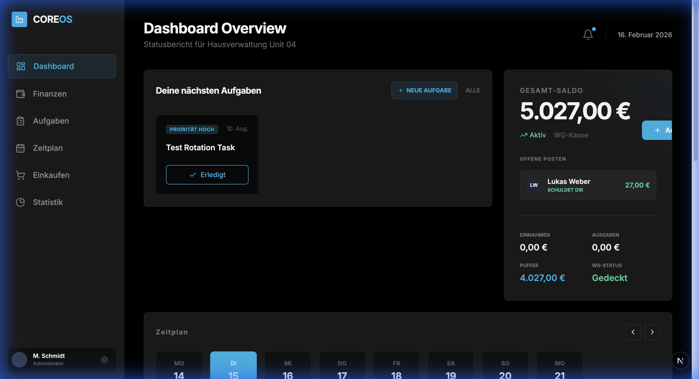
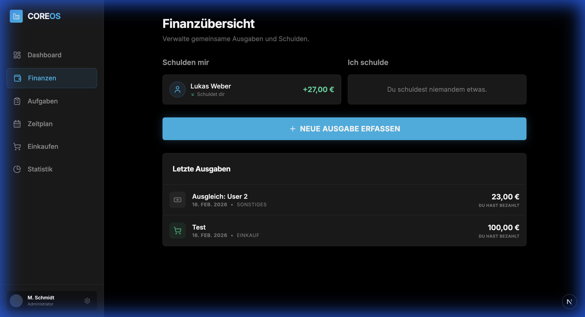
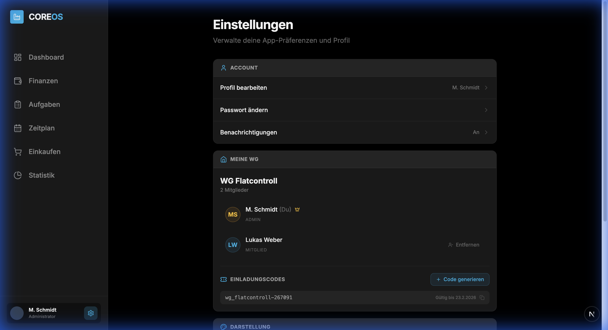
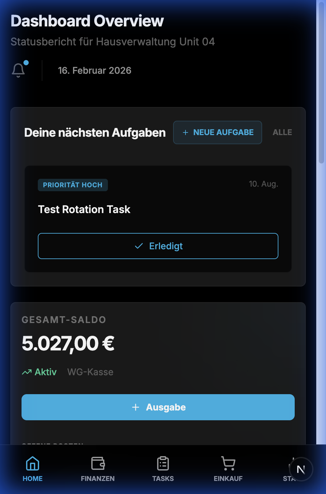

<p align="center">
  
</p>

<h1 align="center">🏠 TidyUp · WG-Manager</h1>

<p align="center">
  <strong>A modern, full-featured shared flat management app.</strong><br/>
  Task scheduling · Expense splitting · Shopping lists · Statistics · WG management
</p>

<p align="center">
  
  
  
  
  
</p>

---

## ✨ Features

| Feature | Description |
|---------|-------------|
| **📊 Dashboard** | At-a-glance overview with upcoming tasks, finances, weekly schedule, and activity feed |
| **💰 Finances** | Peer-to-peer expense tracking with automatic debt calculation and settle-up |
| **📋 Task Management** | Cleaning tasks with priorities, due dates, and automatic rotation (daily/weekly/monthly) |
| **🛒 Shopping List** | Shared shopping list with real-time item tracking |
| **📈 Statistics** | Visual analytics with charts showing contribution, spending trends, and performance |
| **⚙️ WG Settings** | Member management, admin controls, and invitation code generation |

---

## 📸 Screenshots

<table>
  <tr>
    <td><strong>Expenses & Debt Tracking</strong></td>
    <td><strong>Settings & WG Management</strong></td>
  </tr>
  <tr>
    <td></td>
    <td></td>
  </tr>
</table>

<details>
<summary><strong>📱 Mobile View</strong></summary>
<br/>
<p align="center">
  
</p>
</details>

---

## 🏗️ Tech Stack

| Layer | Technology |
|-------|-----------|
| **Framework** | [Next.js 14](https://nextjs.org/) (App Router, Server Actions) |
| **Language** | TypeScript 5 |
| **Styling** | Tailwind CSS 3.4 with custom dark theme |
| **UI Components** | Radix UI (Dialog, Select, Label) + shadcn/ui primitives |
| **Icons** | Lucide React |
| **Charts** | Recharts 3 |
| **Date Handling** | date-fns |
| **Testing** | Vitest + Testing Library |
| **Data** | JSON file-based storage (`data/db.json`) |

---

## 🚀 Getting Started

### Prerequisites

- **Node.js** ≥ 18
- **npm** ≥ 9

### Installation

```bash
# Clone the repository
git clone https://github.com/jranners/wg-putzplan.git
cd wg-putzplan

# Install dependencies
npm install

# Start the development server
npm run dev
```

Open [http://localhost:3000](http://localhost:3000) in your browser.

### Available Scripts

| Command | Description |
|---------|-------------|
| `npm run dev` | Start development server with hot reload |
| `npm run build` | Create production build |
| `npm run start` | Start production server |
| `npm run lint` | Lint the codebase |
| `npm run test` | Run unit tests |
| `npm run test:watch` | Run tests in watch mode |

---

## 📁 Project Structure

```
wg-putzplan/
├── data/
│   └── db.json                  # JSON database (users, tasks, expenses, etc.)
├── src/
│   ├── app/
│   │   ├── page.tsx             # Dashboard
│   │   ├── actions.ts           # Server actions (CRUD, debt calc, WG mgmt)
│   │   ├── expenses/            # Finance & debt tracking page
│   │   ├── tasks/               # Task management page
│   │   ├── shopping/            # Shopping list page
│   │   ├── statistics/          # Analytics & charts page
│   │   └── settings/            # Settings & WG management page
│   ├── components/
│   │   ├── dashboard/           # StatCard, TaskCard, NewTaskModal, etc.
│   │   ├── expenses/            # DebtList, ExpenseList, AddExpenseForm, SettleUpModal
│   │   ├── tasks/               # DetailedTaskList, EditTaskForm, TaskSchedule
│   │   ├── shopping/            # ShoppingComponents
│   │   ├── statistics/          # StatisticsCharts, TaskPerformance
│   │   ├── settings/            # WGMemberList
│   │   ├── layout/              # Sidebar, MobileNav, Header
│   │   └── ui/                  # Base UI components (Button, Dialog, Input, etc.)
│   ├── lib/
│   │   ├── utils.ts             # Utility functions
│   │   └── debt.ts              # Debt calculation engine
│   └── types/
│       └── index.ts             # TypeScript interfaces (User, Task, Expense, WG, etc.)
├── DESIGN.md                    # Design system documentation
├── tailwind.config.ts
├── vitest.config.ts
└── package.json
```

---

## 🎨 Design System

The app follows an **Industrial Precision** dark theme with the following key tokens:

| Token | Value | Usage |
|-------|-------|-------|
| **Background** | `#000000` | App background |
| **Surface** | `#1A1A1A` | Cards and panels |
| **Primary Accent** | `#13B6EC` | Actions, active states, highlights |
| **Success** | `#10B981` | Positive balances, completed tasks |
| **Error** | `#EF4444` | Debts, overdue items |
| **Font** | Inter | All UI text |

See [DESIGN.md](DESIGN.md) for the full design system specification.

---

## 🔑 Key Concepts

### Peer-to-Peer Debt Calculation
Expenses are split equally among WG members and debts are calculated as net balances between each pair of users. Settlements are tracked separately from expenses to ensure accurate accounting.

### Task Rotation
Tasks can be configured with automatic rotation intervals. The system cycles through WG members based on the configured pattern (daily, weekly, biweekly, monthly).

### WG Management
Admins can manage their WG through the settings page:
- **Kick members** (two-click confirmation)
- **Generate invitation codes** (format: `WG_ID-XXXXXX`, 7-day expiry)

---

## 📄 License

ISC
